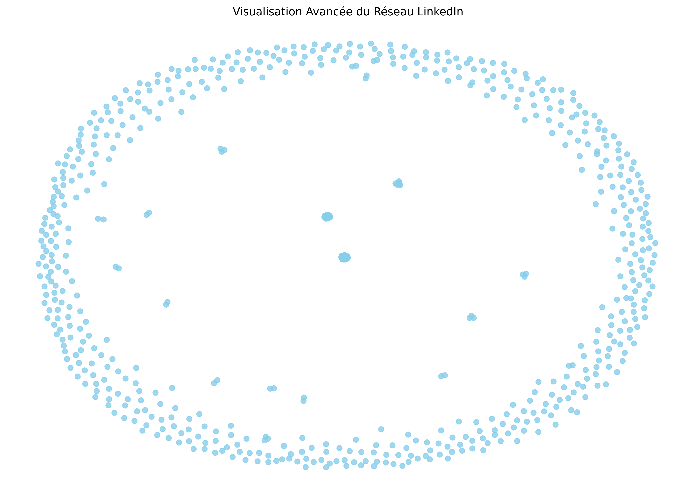

# 🕸️ LinkedIn Network Mapper

> Cartographiez, analysez et visualisez votre réseau LinkedIn comme jamais auparavant !


---

## 🚀 Objectifs du projet

- Cartographier votre réseau LinkedIn à partir d'un fichier CSV exporté.
- Détecter automatiquement des communautés et clusters.
- Générer des rapports PDF (par année, entreprise, etc.).
- Produire un fichier Excel de vos contacts stratégiques.
- Visualiser le réseau sous forme de graphe interactif.
- Proposer un Dashboard web interactif via Streamlit.

---

## 📸 Présentations Visuelles

### Exemple de Graphe Réseau



---

## ✨ Fonctionnalités principales

- 🗂 Importation du réseau LinkedIn (export CSV standard)
- 📈 Analyse des tailles de communautés (bar chart)
- 🖼️ Visualisation graphique avancée avec NetworkX
- 📝 Génération de rapports PDF (graphe + statistiques)
- 📊 Export Excel des contacts stratégiques
- 🖥️ Dashboard interactif pour filtrer et explorer son réseau

---

## 📂 Organisation du projet

linkedin_network_mapper/
│
├── data/
│   └── connections.csv       # Ton fichier LinkedIn exporté
│
├── src/
│   ├── __init__.py           # Fichier vide pour faire de src un package
│   ├── load_data.py          # Charger et préparer les données
│   ├── visualize_graph.py    # Visualiser le graphe
│   ├── advanced_build_graph.py  # Construire le graphe avancé
│   ├── advanced_visualize_graph.py  # Visualisation avancée du graphe
│   ├── generate_report.py    # Générer des rapports PDF
│   ├── generate_excel.py     # Générer un fichier Excel de contacts stratégiques
│   ├── filter_data.py        # Filtrer les données (par année, entreprise, etc.)
│
├── exploratory_analysis.py  # Notebook pour tests et explorations rapides du fichier csv avant utilisation (possibilité d'enrichir avec des données externes)
│   
│
├── requirements.txt          # Dépendances Python
├── main.py                   # Script principal pour tout exécuter
├── dashboard.py              # Script pour lancer le Dashboard Streamlit
└── README.md                 # Instructions pour utiliser le projet


## ⚙️ Installation rapide

```bash
# Cloner le projet
git clone https://github.com/ton-utilisateur/linkedin-network-mapper.git
cd linkedin-network-mapper

# Installer les dépendances
python3 -m venv venv  # Créer un environnement virtuel
source venv/bin/activate  # Sur Linux

# Installer les dépendances
pip install -r requirements.txt
pip freeze > requirements.txt

# Ajouter les données dans le fichier data

# Lance l'application
python3 main.py

# Lance le dashoboard streamit
streamlit run dashboard.py

